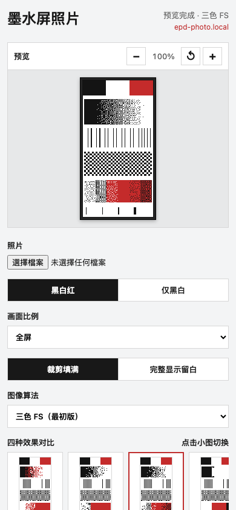

# ESP8266EX + PDI E2266FS092 Photo Display

This firmware turns an ESP8266EX and PDI E2266FS092 2.66-inch tri-color
e-paper panel into a Wi-Fi photo display. The browser decodes, crops, resizes, and
converts each photo at the panel's native resolution. The default algorithm is
a direct port of Waveshare's official Wi-Fi demo dithering path for its
152x296 2.66-inch (B) panel. The two earlier local Floyd-Steinberg modes remain
available, while the coherent black/white mode is only an experiment. The web
interface is in Chinese.
The ESP8266 receives only two packed 5,624-byte image planes.



## Highlights

- Browser-side photo decode, crop, pinch zoom, rotation, resize, and dithering
- Waveshare official dithering plus the original mono and tri-color
  Floyd-Steinberg modes
- Side-by-side previews of all four algorithms before the physical refresh
- Built-in panel calibration target and per-browser black/red profile
- Full-screen clear, saved-frame reload, IP screen, and three button-press actions
- Local HTTP API, TCP control on port 8266, mDNS, and authenticated OTA
- iPhone Photos Shortcut upload flow with an editable browser handoff

## Hardware

| Part | Model and requirement |
| --- | --- |
| Main controller | **Espressif ESP8266EX**, 4 MB flash; Arduino target: Generic ESP8266 Module |
| E-paper panel | **Pervasive Displays (PDI) E2266FS092**, 2.66 inch, 296x152, black/white/red, 24-pin 0.5 mm FPC |
| E-paper driver IC | **UC8253**, using the panel's factory OTP LUT |
| Booster-current selector | **0.57R** for this panel; disconnect power before changing it |
| Arduino core | ESP8266 Arduino Core 3.1.2 |

The firmware uses the panel in portrait orientation, so the browser canvas is
152x296 pixels. It is not a generic driver for other 2.66-inch panels: confirm
the exact panel model and pinout before connecting different hardware.

The Waveshare port was checked against the official
[Floyd-Steinberg guide](https://www.waveshare.com/wiki/E-Paper_Floyd-Steinberg)
and `Loader_esp32wf/scripts.h` from the official
[ESP driver-board demo](https://files.waveshare.com/upload/5/50/E-Paper_ESP32_Driver_Board_Code.7z).
The inspected archive SHA-256 is
`d4764983b1e8b1ef8e219d6de0aea3be85c54409e768b0e6f5026e044b48a1f9`.

## Configure and build

1. Copy `secrets.example.h` to `secrets.h`.
2. Set the Wi-Fi, fallback AP, and OTA credentials in `secrets.h`.
3. Compile for a Generic ESP8266 Module with 4 MB flash and a 1 MB filesystem.

Example Arduino CLI command:

```sh
arduino-cli compile \
  --fqbn 'esp8266:esp8266:generic:CrystalFreq=26,eesz=4M1M,FlashMode=dout,FlashFreq=40,baud=115200' \
  esp8266-epd-photo
```

`secrets.h` and compiled firmware images are ignored by Git because firmware
binaries contain the configured credentials.

## Connect and upload

1. Connect a phone to the same Wi-Fi as the ESP8266.
2. Hold FLASH for 1.5 to 5 seconds; release it while the LED is steadily lit,
   then open the IP shown on the EPD. In station mode you can also open
   `http://epd-photo.local/`.
3. Select a photo and leave the algorithm on **Waveshare official dithering**.
   Choose its frame ratio and adjust the crop if necessary. The two original FS
   modes remain available for comparison.
4. Press **Upload to display** and wait for the completion status.

If the configured Wi-Fi cannot be reached within 20 seconds, the device starts
the fallback hotspot configured in `secrets.h` at `192.168.4.1`. Photo
processing stays in the browser.

## Display behavior

- Logical image size: 152x296 pixels, native portrait orientation
- Panel mode: standard KWR full refresh using the factory OTP LUT
- Black plane: `DTM1 (0x10)`, `1=white`, `0=black`
- Red plane: `DTM2 (0x13)`, `0=no red`, `1=red`
- SPI clock: 4 MHz
- Uploaded frame size: 11,248 bytes
- Photo data is saved atomically in LittleFS before display refresh
- Frame choices: full screen, original, 1:1, 3:4, 2:3, and 9:16
- Layout choices: center crop or fit with white margins
- Manual rotation: 90-degree steps in the browser preview
- Manual crop: drag to pan, pinch to zoom, or use a Mac trackpad to pan and
  pinch; the buttons provide zoom and recenter fallbacks
- Preview active area: 31x60 mm at 100%, with a 60%-180% per-browser
  calibration control for devices whose CSS physical units do not match reality
- Image algorithms: **Waveshare official dithering**, **Floyd-Steinberg
  (original)**, **Three-color FS (original)**, and the optional **Black/white
  regions (experimental)**
- The comparison strip renders all four algorithms from the same crop after
  editing pauses. Selecting a small preview switches the main preview and the
  frame that will be uploaded.
- The built-in calibration target contains black/white/red blocks, 12 gray
  steps, 1-2 pixel line patterns, a checker pattern, and red saturation steps.
- Per-browser panel calibration stores black-threshold and red-sensitivity
  offsets in local storage. The offsets apply to the original FS and
  three-color FS processing paths; the Waveshare official port deliberately
  bypasses them so its output remains an exact official-algorithm comparison.
- Restoring the panel defaults sets both calibration offsets back to zero.
- Waveshare mode uses the official `[0,0,0]`, `[255,255,255]`, and `[127,0,0]`
  palette, unweighted squared RGB distance, left-to-right scanning, and the
  demo's half-strength error distribution (`weight / 32`)
- Waveshare mode bypasses exposure, sharpening, smoothing, red masking, and all
  manual detail controls, matching the official browser processing path after
  this app has resized and cropped the image to 152x296
- The original Floyd-Steinberg mode uses one-direction, full-strength luma
  error diffusion and exposes all manual detail controls
- The original three-color FS mode uses serpentine RGB error diffusion and
  chooses the nearest calibrated black, white, or red panel color
- The experimental black/white mode operates on the final 152x296 pixels,
  applies bounded percentile exposure correction and edge-preserving smoothing,
  extracts only
  connected high-saturation red areas, then combines an Otsu threshold with
  local brightness and two cleanup passes to form coherent black/white regions
- The experimental black/white mode performs no error diffusion, avoiding the
  dense dots and worm-like texture that Floyd-Steinberg creates in portrait
  midtones
- The experimental black/white mode hides all detail sliders
- Web clear makes the display white but keeps the stored photo
- Short FLASH press (under 1.5 seconds): reload the photo stored in LittleFS
- Long FLASH press (1.5 to 5 seconds): clear and show the current IP
- Extra-long FLASH press (at least 5 seconds): clear the display to white
- The onboard LED is steady at the IP threshold and blinks at the clear
  threshold; the action runs after the button is released
- The EPD is powered off after every refresh
- A retained-screen marker prevents needless refreshes after an ESP8266 reboot
- No OTP programming commands are used

At least one photo must be uploaded before short-press recall can work. The
status endpoint reports this as the boolean `stored` field.

## LAN API and OTA

The HTTP interface remains local to the same Wi-Fi/AP as the device. Commands
that update the display return `202` immediately; poll the status endpoint
until `state` becomes `done` or `error` before sending another command.

| Method | Path | Purpose |
| --- | --- | --- |
| `GET` | `/api/status` | State, refresh duration, address, stored-photo flag, firmware version, uptime, free heap, Wi-Fi mode, and RSSI |
| `POST` | `/api/frame` | Upload the same 11,248-byte packed black-plane then red-plane payload used by the web page |
| `POST` | `/api/display/reload` | Display the photo saved in LittleFS |
| `POST` | `/api/display/clear` | Clear the panel while retaining the saved photo |
| `POST` | `/api/display/ip` | Show the current IP-address screen |
| `POST` | `/api/shortcut/photo` | Accept a multipart `photo` image for the iPhone shortcut |
| `GET` | `/shortcut?shortcut=1` | Load the shortcut photo into the editor and wait for manual confirmation |

For example, `curl http://DEVICE_IP/api/status` reads the device state and
`curl -X POST http://DEVICE_IP/api/display/reload` recalls the saved photo.

TCP control also listens on port `8266`, one uppercase command per line:
`STATUS`, `RELOAD`, `CLEAR`, `IP`, or `HELP`. It is intended for trusted LAN
automation, so do not expose this port through router port forwarding.

In station mode, mDNS advertises `epd-photo.local`, `_http._tcp` on port 80,
and `_epd-photo._tcp` on port 8266. The fallback access-point address remains
`192.168.4.1`; `.local` resolution is not guaranteed in fallback AP mode.
`/api/status` reports `hostname` and whether mDNS started in the `mdns` field.

The web page's **Firmware OTA update** button opens `/update`. It uses the
ESP8266 core's official HTTP OTA handler with HTTP Basic authentication. Use
the OTA credentials configured in `secrets.h`; use unique credentials before
connecting the device to an untrusted LAN. Upload
the `.ino.bin` produced by the current build.
The handler verifies the uploaded ESP8266 binary before rebooting into it.
OTA replaces only the application firmware and preserves the saved photo in
LittleFS. Do not power the board off while the upload is in progress; the
browser can wait through the reboot before the page becomes reachable again.

An iPhone Shortcut can appear in the Photos share sheet. Resize the input to
800 pixels, convert it to JPEG, then POST it as the multipart field `photo` to
`http://epd-photo.local/api/shortcut/photo`. Finally open
`http://epd-photo.local/shortcut?shortcut=1`; that page loads the image into the
same editor as the normal web page, keeps the default Waveshare dithering path, and
waits for you to crop, zoom, rotate, or change the algorithm before pressing
**上传到墨水屏**. Keep the phone on the same LAN as the ESP8266. The uploaded
source is capped at about 850 KiB to fit the 1 MB LittleFS partition; for very
large iPhone originals, resize and convert before the upload action.

For the board's booster-current resistor selector, use `0.57R` with the
E2266FS092 panel. Its panel reference circuit and the UC8253 booster reference
both specify 0.47 ohm; 0.57 ohm is the matching available setting. Do not use
`3R` for this panel. Change the selector only while power is disconnected.

Pin mapping is unchanged from the text demo:

| Signal | ESP8266 board pin | GPIO |
| --- | --- | --- |
| BUSY_N | D1 | 5 |
| RESET_N | D4 | 2 |
| DC | D2 | 4 |
| CSB | D8 | 15 |
| SCL | D5 | 14 |
| SDA/MOSI | D7 | 13 |
| IP display button | FLASH | 0 |

## Physical verification

Tested on the connected ESP8266EX and E2266FS092 panel on 2026-08-07 and
2026-08-09:

- Current firmware compiled with ESP8266 core 3.1.2:
  42,668 bytes RAM (53%), 60,891 bytes IRAM (92%), and 382,268 bytes flash
- USB flashing and authenticated OTA were both verified; OTA preserved the
  stored frame in LittleFS
- Full photo, clear, IP-screen, and stored-frame reload refreshes completed with
  no BUSY timeout; measured full refreshes were approximately 11-16 seconds
- Wi-Fi station mode, fallback AP mode, `epd-photo.local`, HTTP API, and TCP
  control were verified on the physical device
- Browser uploads delivered exactly 11,248 bytes per frame and the panel powered
  off after every refresh
- Chrome verified all four comparison canvases, crop/zoom/rotation,
  selected-algorithm switching, and calibration profile changes
- Desktop and 390x844 mobile-width checks showed no page-level horizontal
  overflow; the four-preview strip scrolls horizontally on mobile as designed

Waveshare color and mono dithering and both restored local Floyd-Steinberg modes
were verified in the browser with the same fixture and are now live on the
device. The current firmware still requires a final physical-panel comparison
with the user's real photo; browser fixture testing and successful flashing are
not substitutes for that check.

## Recovery

Back up the device's complete 4 MB flash before the first write. Device-specific
backups and firmware binaries are intentionally not included in this repository
because they can contain Wi-Fi and OTA credentials. Restoring a complete flash
image also restores its filesystem contents.
